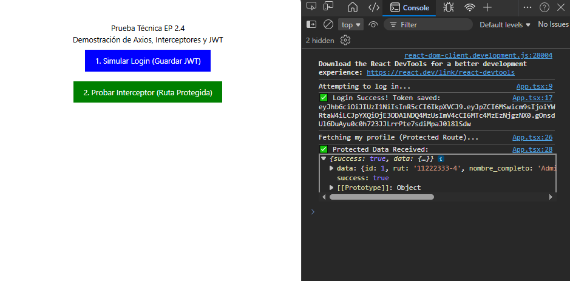
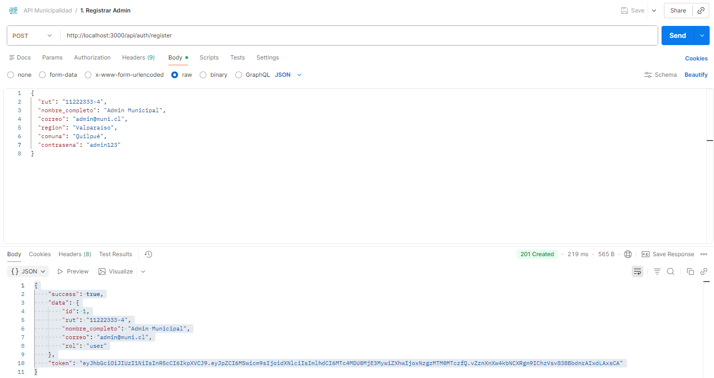
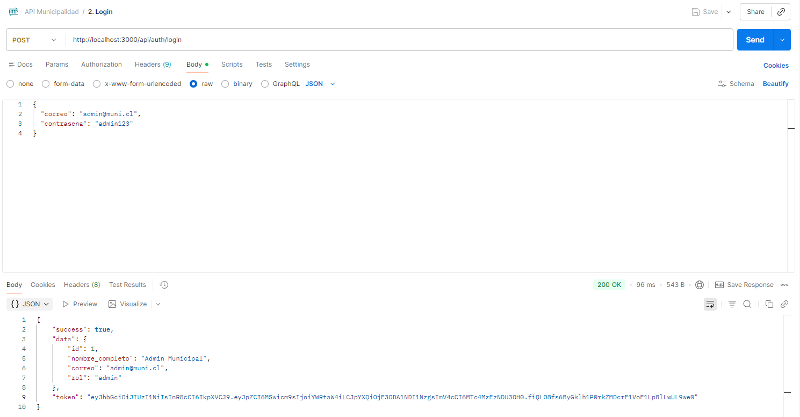
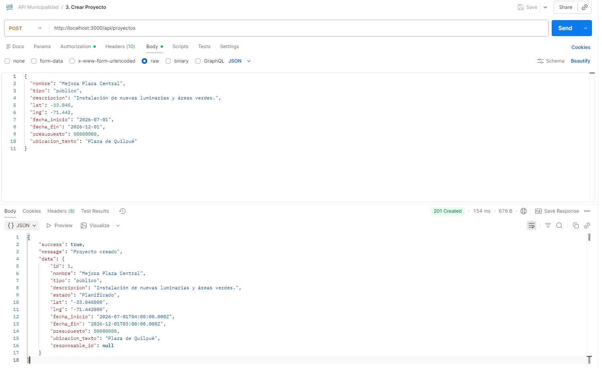
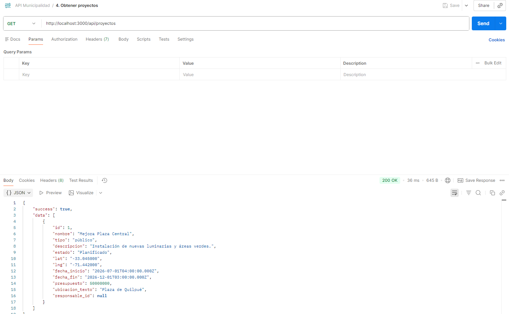

# Entrega-Parcial-2-Desafio20-Web-y-movil

## Integrantes 

Vicente Robles (Rol : Programador)
Alfredo Escobar (Rol : Programador)
Joaquín Rojas (Rol : Documentador)

## Instrucciones de uso

### Instalación y ejecución básica

Clonamos el repositorio

```bash
git clone https://github.com/vichoRobles/Entrega-Parcial-2-Desafio20-Web-y-movil
cd <tu-carpeta-backend>
```
Instalamos las dependencias
```bash
npm install
```
Instalamos las dependencias de TypeScript y generamos su configuración
```bash
npm install --save-dev typescript ts-node @types/node @types/express @types/cors @types/jsonwebtoken @types/bcrypt @types/pg

npx tsc --init
```

Configuramos las variables del entorno

```
PORT=3000
DB_PORT=5432
DB_USER=postgres
DB_PASSWORD=tu_contraseña
DB_HOST=localhost
DB_NAME=nombre_de_la_db
JWT_SECRET=jwt_secret
```

Corremos la aplicación, en este caso utilizamos el script 'npm run dev' debido a que permite prototipado rápido para las entregas.
```bash
npm run dev
```

### Base de datos (PostgreSQL & pgAdmin4)

Este proyecto utiliza PostgreSQL para su base de datos relacional, para mayor facilidad utilizaremos la aplicación 'pgAdmin4'.

```url
https://www.pgadmin.org/download/pgadmin-4-windows/
```

1. **Abrimos pgAdmin4** y nos conectamos al servidor de PostgreSQL local.
2. **Creamos una base de datos nueva:**
   * Click derecho en **Databases** > **Create** > **Database...**
   * Nombramos la base de datos (e.g., `municipality_db`) y clickeamos **Save**.
3. **Abrimos la 'Query tool':**
   * Click-derecho en la base de datos creada en el menú izquierdo.
   * Seleccionar **Query Tool**.
4. **Ejecutar el Schema:**
   * Abrir el archivo `schema.sql` localizado en el repositorio del backend.
   * Copiar los contenidos del archivo.
   * Pegamos los contenidos en la herramienta Query Tool de pgAdmin4 de la base de datos creada.
   * Clickeamos el boton **Execute/Refresh** (o presionar `F5`).
5. **Verificamos la creación:**
   * En el menú izquierdo, navegamos a `Your Database` > `Schemas` > `public` > `Tables`.
   * Ahora deberian estar presentes las tablas `usuarios`, `proyectos`, y `opiniones` de manera visual en la base de datos.

**Nota en las variables de entorno:** Es importante asegurarse que el archivo `.env` tenga las mismas credenciales de la base de datos que creamos anteriormente (Usuario, Contraseña, Puerto, y nombre de la base de datos).

## EP 2.1: Creación del servidor en Node.js con Express o Flask

El servidor es la base para implementar un backend de una aplicación, y esto permite procesar inicialmente los datos además de comunicarse con la base de datos posterior u otros servicios externos.

Para la creación de Node.js utilizamos Express y también implementamos Cors para la seguridad, la creación del servidor está en el directorio "server.ts".

## EP 2.2: Configuración y modelado de la base de datos relacional.

Se configuraron y modelaron las bases de datos en PostgreSql, a continuación se explica la utilidad de la base de datos :

**(1)** La utilidad principal de la base de datos está en definir una estructura sólida gracias al modelo entidad-relación, permitiendo así contar con un almacenamiento seguro de los datos. 

**(2)** La base de datos es indispensable en el backend para validar identidades (ID) usando tanto llaves primarias (Primary key) como llaves foráneas (Foreign key).

**(3)** La base de datos permite gestionar los datos a través de el uso de múltiples comandos, los más importantes se detallan a continuación :

a) SELECT : Herramienta principal para extraer datos

b) ORDER BY : Ordenar los datos para poder visualizarlos con mayor claridad

c) JOIN : Para juntar datos relacionados entre sí

d) GROUPBY : Para organizar los datos dividiendo grandes conjuntos de datos en grupos más simples y específicos.

e) CRUD (CREATE, READ, UPDATE, DELETE) : Permiten un control total de los datos.

## EP 2.3:  Desarrollo de API REST con endpoints básicos, manejo adecuado de códigos HTTP y respuestas en formato JSON estructurado.

Una API REST (interfaz de programación de aplicaciones de transferencia de estado representacional) es un estilo de arquitectura considerado el estándar para diseñar y crear aplicaciones Web, su principal utilidad radica en proporcionar un conjunto de reglas y restricciones que permiten tener servicios web sencillos, escalables y fáciles de integrar, a continuación se detallan sus 3 principales características :

### Uso de endpoints básicos (GET, POST, PUT/PATCH y DELETE)

Los endpoints básicos son los principales puntos de acceso o rutas definidas en la API REST, los cuales permiten interactuar con los recursos del sistema mediante las solicitudes HTTP. Cada endpoint posee una operación específica utilizando los métodos HTTP para indicar la operación que se desea realizar sobre los datos.

**GET :** Operación utilizada para obtener información

**POST :** Operación utilizada para crear nuevos recursos

**PUT/PATCH :** Operaciones que sirven para actualizar información

**DELETE :** Operación utilizada para eliminar recursos

**Nota :** Su equivalente en base de datos son los comandos CRUD (CREATE, READ, UPDATE, DELETE)

### Manejo adecuado de códigos HTTP

Consiste en usar correctamente los códigos de estado que son definidos por el protocolo HTTP para indicar un resultado de una solicitud de un cliente al servidor, a continuación se muestran los principales códigos HTTP y cómo debe ser su uso adecuado :

**Ejemplos principales de códigos HTTP utilizados :**

**200 OK :**  Solicitud exitosa
 
**201 Created :** Recurso creado 

**204 No Content :** Código exitoso sin cuerpo 

**400 Bad Request :** Datos inválidos 

**401 Unauthorized :** Falta autenticación 

**403 Forbidden :** Sin permisos autenticado

**404 Not Found :** No encontrado 

**500 Internal Server Error :** Error del servidor 


### Respuestas en formato JSON estructurado 

El objetivo de las respuestas en formato JSON estructurado es devolver la información de una API usando la sintaxis de JSON(JavaScript Object Notation) adecuadamente.

Es de gran utilidad ya que JSON es actualmente el estándar más usado para la comunicación entre cliente-servidor, y esto se debe a su simplicidad y compatibilidad con muchos lenguajes de programación.

**Ejemplo de la estructura de la respuesta JSON :**

```

  "items": [
    {
      "id": 1
      "valor": "valor1"
      "valor" : "valor2"
      "activo" : true
    },

    {
      "id": 2
      "valor": "valor3"
      "valor" : "valor4"
      "activo" : false
    },

    {
      "id": 3
      "valor": "valor5"
      "valor" : "valor6"
      "activo" : true
    }
  ]

```
    

## EP 2.4: Consumo de la API REST desde Ionic con React utilizando fetch o Axios, implementando manejo de errores, interceptores y gestión de tokens JWT 

 En esta etapa, se debe integrar el frontend que desarrollamos con Ionic junto a una API REST, esto permite que la aplicación móvil se comunique con el servidor para enviar o recibir información relevante. El objetivo de esto es hacer que la interfaz de usuario pueda consumir los servicios expuestos por la API de forma segura.

 **Esta etapa involucra 4 acciones clave :** Consumo de la API REST, uso de fetch (en nuestro caso utilizamos axios) , manejo de errores, interceptores y gestión de tokens JWT.

 **1) Consumo de la API REST :** Realizar solicitudes HTTP desde la app hasta el servidor para obtener datos.

 **2) Manejo de errores :** Pueden ocurrer diferentes errores durante las comunicaciones que se deben manejar, estos errores principalmente se manejan en los códigos HTTP del 400 al 500 donde los más comunes son : Error 404 Recurso no encontrado, error 400 datos inválidos y error 500 ocurrió un error en el servidor.

 **3) El uso de interceptores :** Es el uso de funciones que se ejecutan automáticamente antes de mandar la solicitud (req) o después de recibir la respuesta (res).

 **4) Gestión de tokens JWT :** El JWT (JSON WEB TOKEN) es un mecanismo de autenticación basado en un token, cuando se inicia sesión, todo usuario recibe un token secreto y seguro que autentica que es él quien inició sesión.  

 A continuación se adjuntará un PoC (Proof of Concept) que se realizó en el cual, utilizando Axios y modificaciones temporales a App.tsx para realizar las pruebas, se puede observas que es completamente funcional, y posee interceptores y gestión de tokens JWT utilizando las credenciales de administrador predeterminadas que se utilizan en el punto EP2.7 de las pruebas con Postman.

 Se puede observar como, con el archivo src/api.ts ubicado en el repositorio del frontend, podemos configurar Axios, escribir interceptores, manejar erorres con la API y manejar JWT's en el ambiente frontend de manera exitosa con resultados identicos que los que se presentan en el punto EP2.7.

 


## EP 2.5: Implementación de autenticación con JWT con formulario de registro e inicio de sesión, rutas protegias en frontend, generación y validación de JWT, diferenciación por roles.

La implementación de autenticación JWT (JSON Web Token) consiste en hacer un mecanismo de seguridad que permita corrroborar la identidad de los usuarios y controlar el acceso que tienen a los recursos, esto se hace principalmente a través de un formulario de registro e inicio de sesión y también hay otras buenas prácticas complementarias como lo son las rutas protegidas en el frontend, generación y validación JWT además de la diferenciación por roles, todo esto lo implementamos en el proyecto porque es de suma importancia mantener una autenticación segura para los usuarios a la hora de crear una app, a continuación se desglosan estas buenas prácticas :

**1) Formularios de registros :** Estos formularios permiten que nuevos usuarios puedan ingresar a la app iniciando sesión.

**2) Formularios de inicio de sesión :** Permiten que los usarios accedan al contenido iniciando sesión de manera segura y autenticada.

**3) Rutas protegidas en el frontend :** Son las rutas protegidas las cuales restrigen acceso a distintas pantallas de la aplicación de las cuales no se tengan los permisos necesarios para acceder.

**4) Generación del JWT :** Se genera un JWT el cual asegura la autenticación del usuario que se hizo previamente en inicio de sesión (se crea un token seguro que corrobora que es precisamente el usuario quien inició sesión)

**5) Validación del JWT :** Se valida el token seguro cada vez que el usuario realiza una acción protegida (por ejemplo : cambiar de contraseña) y comprobando también que este token no haya expirado por exceso de tiempo sin re-autenticación.

**6) Diferenciación por roles :** Se aplica un control de acceso basado en roles (RBAC) el cual establece que, dependiendo del rol de quien ingresa, tiene acceso a determinados archivos específicos ( Ejemplo : Los clientes tienen acceso a la visualización de una aplicación pero no a los códigos del sistema como si podría tener un administrador)

**¿Por qué es de utilidad implementar la autenticación JWT? :** No es solo un detalle técnico, la autenticación con JWT garantiza que el usuario esté protegido a la hora de navegar por las pantallas de la aplicación, es un filtro básico pero poderoso que evita posibles suplantaciones de identidad indebidas, a primera vista, puede parecer molesto o incluso incómodo que el usuario necesite corroborar su identidad constantemente, incluso re-auteticar al estar mucho tiempo navegando por la app, pero es una medida de seguridad completamente necesaria para garantizar la privacidad del usuario.

## EP 2.6: Validación de usuarios y manejo de sesiones con validación de inputs, Hash de contraseñas con bcrypt, Manejo seguro de credenciales, Protección básica contra inyección SQL.

Estos son mecanismos enfocados en la ciberseguridad utilizados en aplicaciones para proteger la información, autenticar usuarios y evitar principales ataques los cuales son medidas de seguridad mpas complejas que las vistas anteriormente y aportan un gran avanze en la seguridad de la aplicación, a continuación se detalla cada una de estas medidas de seguridad :

**1) Validación de usuarios y manejo de sesiones :** Este mecanismo corrobora que una persona intentando acceder al sitio tenga las credenciales válidas y autorizadas para un ingreso seguro tanto para el usuario como para nuestra aplicación.

**2) Uso de validación de inputs :** Las entradas o inputs son los datos que ingresa el usuario mediante los formularios o las solicitudes, esta validación que los datos cumplan ciertas reglas básicas antes de ser procesados 

**Ejemplos** : 

email : Juan@gmail.com es válido porque sigue el estandar x@gmail.(dominio de alto nivel, generalmente : .com .cl o .net usados por un usuario en Chile)

edad : abc No es válido, se espera que la edad ingresada sea un valor numérico en un rango plausible (generalmente de 0 a 120)


**3) Hash de contraseñas utilizando bcrypt :** Las contraseñas nunca deben almacenarse como texto simple, necesitan tener un seguro el cuál se denomina Hashing y permite la encriptación de contraseñas usando bcrypt el cual transforma una contraseña en una cadena cifrada irreversible la cual se conoce como hash.

**4) Manejo segura de las credenciales :** Una credencial incluye usuario, contraseña, tokens JWT, claves API y secret keys (llaves secretas las cuales permiten seguridad), para mantenerlas de forma segura seguimos las siguientes buenas prácticas de codificación : No mostrar las credenciales en el código fuente, no almacenarlas como texto simple y utilizar cifrados para evitar que las credenciales sean expuestas.

**5) Protección básica contra la inyección SQL :** Esto se refiere a una protección contra uno de los ataques de internet más usados en internet que consiste introducir comandos SQL en los datos de entrada para alterar nuestras bases de datos de la aplicación, esto se solventa parametrizando funciones, es decir, tratar los datos como información y no como un código SQL.

## EP 2.7: Pruebas funcionales considerando pruebas en Postman o Insomnia, Documentación de endpoints, Evidencia de pruebas.

Para el caso de las pruebas en Postman, en el repositorio se encuentra el archivo API Municipalidad.postman_collection.json el cual evidencia las requests que se realizaron y se ejecutaron de manera éxitosa con el backend funcionando.

Cabe mencionar que luego de la prueba 1. Registrar Admin, se ejecutó la siguiente query en la base de datos de manera manual ya que si se deja la capacidad de registrar administradores por medio del endpoint sería una grave falta de seguridad, por lo que decidimos que sería mejor dejar la asignación de administradores a que sea de manera manual.

```sql
UPDATE usuarios SET rol = 'admin' WHERE correo = 'admin@muni.cl';
```

A continuación se adjuntarán las pruebas realizadas en formato de imagenes, siendo estas:
- 1. Registrar admin (un usuario común en la práctica)
- 2. Login (Generando nuestro Bearer Token)
- 3. Crear proyecto (Entregamos el Bearer Token y se crea el proyecto)
- 4. Obtener proyectos









Para mayor información acerca de los endpoints de nuestra API, refierase al documento API_DOCS.md en el cual se detalla de mejor manera cada endpoint.


